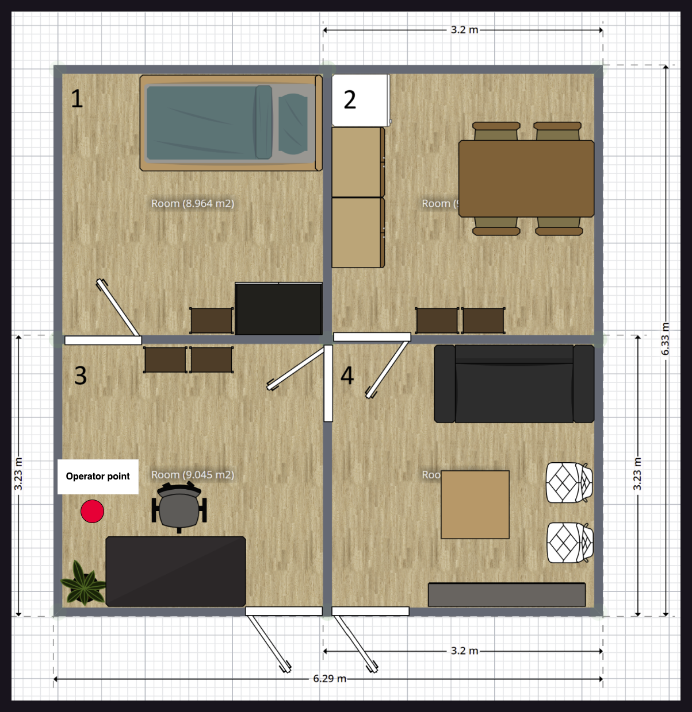

# Robocup Malaysia Open 2024 @Home League

Rule for the competition: https://2024.robocup.org.my/challenges-and-rules/home

## Table of contents
- [Scores](#scores)
- [Schedules](#schedules)
   - [Day 1 - 5 Sep 2024](#day-1--5-september-2024)
   - [Day 2 - 6 Sep 2024](#day-2--6-september-2024)
   - [Day 3 - 7 Sep 2024](#day-3--7-september-2024)
- [Field Layout](#field-layout)
   - [Robot Checking](#robot-checking)
   - [Carry My Luggage](#carry-my-luggage)
   - [Find My Mate](#find-my-mate)
   - [Storing Groceries](#storing-groceries)
   - [Receptionist](#receptionist)
   - [General Purpose Service Robot](#general-purpose-service-robot)
- [Information](#information)

## Scores

### @HOME OPL
| Team name       |  Poster  | Stage 1 | Stage 2 | Final |
|-----------------|----------|---------|---------|-------|
| USM Infinity    |   8.33   |         |         |       |
| UTAR            |   7.33   |         |         |       |
| TwiggiesAid     |    7.5   |         |         |       |
| Team Terminator |    6.5   |         |         |       |

#### Stage 1
|Team name|Storing Groceries|Receiptionist|Carry my luggage|General Purpose Service Robot (GPSR)|Serve Breakfast|Stage 1 Total
|-|-|-|-|-|-|-|
| USM Infinity    |       |         |         |       |        |     |
| UTAR            |       |         |         |       |        |     |
| TwiggiesAid     |       |         |         |       |        |     |
| Team Terminator |       |         |         |       |        |     |

#### Stage 2
|Team name|Clean the table|Stickler for rules|Restaurant|Enhanced General Purpose Service Robot (EGPSR)|Stage 2 Total
|-|-|-|-|-|-|
| USM Infinity    |       |         |         |       |        |
| UTAR            |       |         |         |       |        |
| TwiggiesAid     |       |         |         |       |        |
| Team Terminator |       |         |         |       |        |

### @HOME EDU
|    Team name      |  Poster   | Carry My Luggage | Find My Mates | Receptionist | Final |
|-|-|-|-|-|-|
| Airost            |           |         |         |       |       |
| USM Titans        |           |         |         |       |       |
| UNIMY             |           |         |         |       |       |
| UniMAP MechaMinds |           |         |         |       |       |
| PutraBot          |           |         |         |       |       |
| FATHI             |           |         |         |       |       |
| Robo in Progress  |           |         |         |       |       |
| SOBITS            |           |         |         |       |       |
| kamerider UTHM    |           |         |         |       |       |
| UM ENIGMA         |           |         |         |       |       |
| UM Homies         |           |         |         |       |       |
| YOLOv9            |           |         |         |       |       |

<!-- Template

| Team name     |  Poster  |
|---------------|----------|
|USM Infinity   |          |
|   UTAR        |          |
|TwiggiesAid    |          |
|Team Terminator|          | 

-->

## Schedules

### Day 1 : 5 September 2024

#### @Home OPL Arena
| # |   Robot Checking (16:30)     | League     |
|---|------------------------------|------------|
| 1 | USM Infinity                 |   OPL      |
| 2 | UTAR                         |   OPL      |
| 3 | TwiggiesAid                  |   OPL      |
| 4 | Team Terminator              |   OPL      |

<!-- ### @Home Education league
####  -->

### Day 2 : 6 September 2024

#### @Home OPL Arena
|#|Storing Groceries (09:30)|#|Receiptionist (10:30)|#|Carry my luggage (11:30)
|-|-|-|-|-|-|
|1|~~UTAR~~|1|TwiggiesAid|1|Team Terminator|
|2|~~Team Terminator~~|2|~~USM Infinity~~|2|~~USM Infinity~~|
|3|~~USM Infinity~~|3|~~UTAR~~|3|~~UTAR~~|
|4|TwiggiesAid|4|~~Team Terminator~~|4|TwiggiesAid|

|#|General Purpose Service Robot (GPSR) (15:00)|#|Serve Breakfast (16:00)|
|-|-|-|-|
|1|TwiggiesAid|1|TwiggiesAid|1|TwiggiesAid
|2|UTAR|2|Team Terminator|2|Team Terminator
|3|USM Infinity|3|UTAR|3|USM Infinity
|4|Team Terminator|4|USM Infinity|4|UTAR

#### @Home EDU Arena

|#|Carry My Luggage (09:30)|#|Find My Mate (14:30)|
|-|-|-|-|
|1|USM Titans|1|Robo in Progress
|2|UM Homies|2|UM Homies
|3|UniMAP MechaMinds|3|kamerider UTHM
|4|UNIMY|4|YOLOv9
|5|Robo in Progress|5|Airost
|6|YOLOv9|6|USM Titans
|7|FATHI|7|PutraBot
|8|UM ENIGMA|8|UM ENIGMA
|9|Airost|9|FATHI
|10|SOBITS|10|SOBITS
|11|kamerider UTHM|11|UNIMY
|12|PutraBot|12|UniMAP MechaMinds

### Day 3 : 7 September 2024

#### @Home OPL Arena
|#|Clean the table (09:30)|#|Stickler for rules (10:30)|#|Restaurant (13:30)|#|Enhanced General Purpose Service Robot (EGPSR) (15:30)|
|-|-|-|-|-|-|-|-|
|1|Team Terminator|1|TwiggiesAid|1|USM Infinity|1|USM Infinity
|2|TwiggiesAid|2|USM Infinity|2|Team Terminator|2|Team Terminator
|3|USM Infinity|3|UTAR|3|UTAR|3|UTAR
|4|UTAR|4|Team Terminator|4|TwiggiesAid|4|TwiggiesAid

#### @Home EDU Arena
|#|Receptionist (09:30)|
|-|-|
|1|Airost
|2|kamerider UTHM
|3|PutraBot
|4|YOLOv9
|5|UM Homies
|6|USM Titans
|7|UNIMY
|8|SOBITS
|9|FATHI
|10|Robo in Progress
|11|UniMAP MechaMinds
|12|UM ENIGMA

## Field Layout

### Robot Checking

### Carry My Luggage

_You can choose that you want the bag on the bed or on the floor_

### Find My Mate

### Storing Groceries

_For Storing Groceries, Kitchen Table will be used as Table and Kitchen Cabinet as Cabinet_

### Receptionist

_Host name is "Danny", His favorite drink is "Lime Juice"_

### General Purpose Service Robot

## Information

- [List of names](./names/names.md)
- [List of drinks](./names//drinks.md)
- [List of room](./maps/room_names.md)
- [List of locations](./maps/location_names.md)
- [List of known objects](./objects/objects.md)
