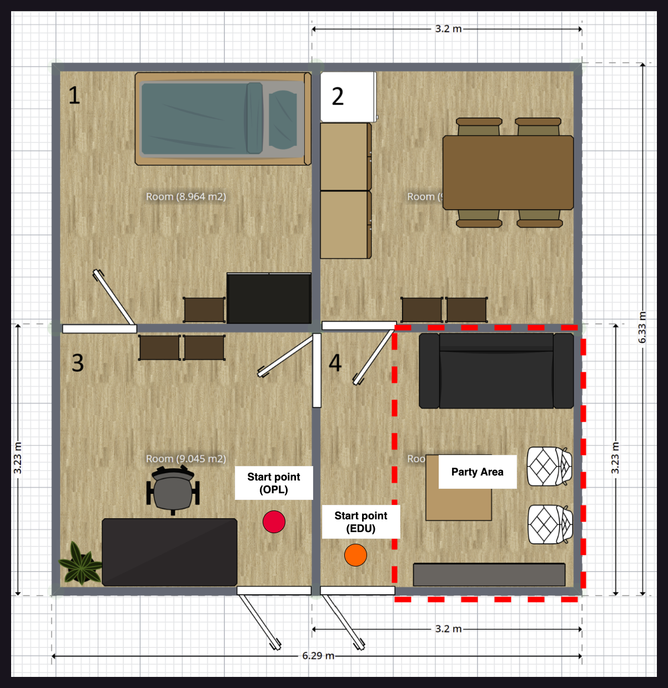

# Robocup Malaysia Open 2024 @Home League

Rule for the competition: https://2024.robocup.org.my/challenges-and-rules/home

## Table of contents
- [Scores](#scores)
- [Schedules](#schedules)
- [Field Layout](#field-layout)
   - [Robot Checking](#robot-checking)
   - [Carry My Luggage](#carry-my-luggage)
   - [Find My Mate](#find-my-mate)
   - [Storing Groceries](#storing-groceries)
   - [Receptionist](#receptionist)
- [Information](#information)

## Scores

### @HOME
| Team name       |  Poster  |
|-----------------|----------|
| USM Infinity    |   8.33   |
| UTAR            |   7.33   |
| TwiggiesAid     |    7.5   |
| Team Terminator |    6.5   |

<!-- ### @HOME EDU
|    Team name      |  Poster   |
|-------------------|-----------|
| Airost            |           |
| USM Titans        |           |
| UNIMY             |           |
| UniMAP MechaMinds |           |
| PutraBot          |           |
| FATHI             |           |
| Robo in Progress  |           |
| SOBITS            |           |
| kamerider UTHM    |           |
| UM ENIGMA         |           |
| UM Homies         |           |
| YOLOv9            |           | -->

<!-- Template

| Team name     |  Poster  |
|---------------|----------|
|USM Infinity   |          |
|   UTAR        |          |
|TwiggiesAid    |          |
|Team Terminator|          | 

-->

## Schedules

### Day1 : 5 September 2024

#### @Home OPL Arena
| # |   Robot Checking (16:30)     | League     |
|---|------------------------------|------------|
| 1 | USM Infinity                 |   OPL      |
| 2 | UTAR                         |   OPL      |
| 3 | TwiggiesAid                  |   OPL      |
| 4 | Team Terminator              |   OPL      |

<!-- ### @Home Education league
####  -->

### Day 2 : 6 September 2024

#### @Home OPL Arena
|#|Storing Groceries (09:30)|#|Receiptionist (10:30)|#|Carry my luggage (11:30)
|-|-|-|-|-|-|
|1|UTAR|1|TwiggiesAid|1|Team Terminator
|2|Team Terminator|2|USM Infinity|2|USM Infinity
|3|USM Infinity|3|UTAR|3|UTAR
|4|TwiggiesAid|4|Team Terminator|4|TwiggiesAid

#### @Home EDU Arena

|#|Carry My Luggage (09:30)|#|Find My Mate (14:30)|
|-|-|-|-|
|1|USM Titans|1|Robo in Progress
|2|UM Homies|2|UM Homies
|3|UniMAP MechaMinds|3|kamerider UTHM
|4|UNIMY|4|YOLOv9
|5|Robo in Progress|5|Airost
|6|YOLOv9|6|USM Titans
|7|FATHI|7|PutraBot
|8|UM ENIGMA|8|UM ENIGMA
|9|Airost|9|FATHI
|10|SOBITS|10|SOBITS
|11|kamerider UTHM|11|UNIMY
|12|PutraBot|12|UniMAP MechaMinds

## Field Layout

### Robot Checking

### Carry My Luggage

### Find My Mate

### Storing Groceries

_For Storing Groceries, Kitchen Table will be used as Table and Kitchen Cabinet as Cabinet_

### Receptionist

## Information

- [List of names](./names/names.md)
- [List of drinks](./names//drinks.md)
- [List of room](./maps/room_names.md)
- [List of locations](./maps/location_names.md)
- [List of known objects](./objects/objects.md)
