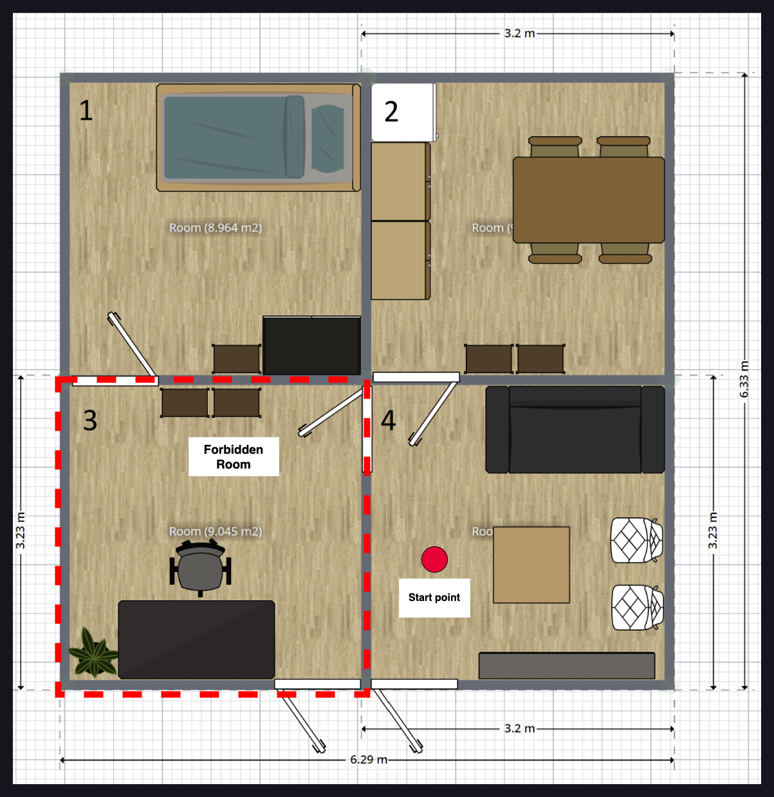
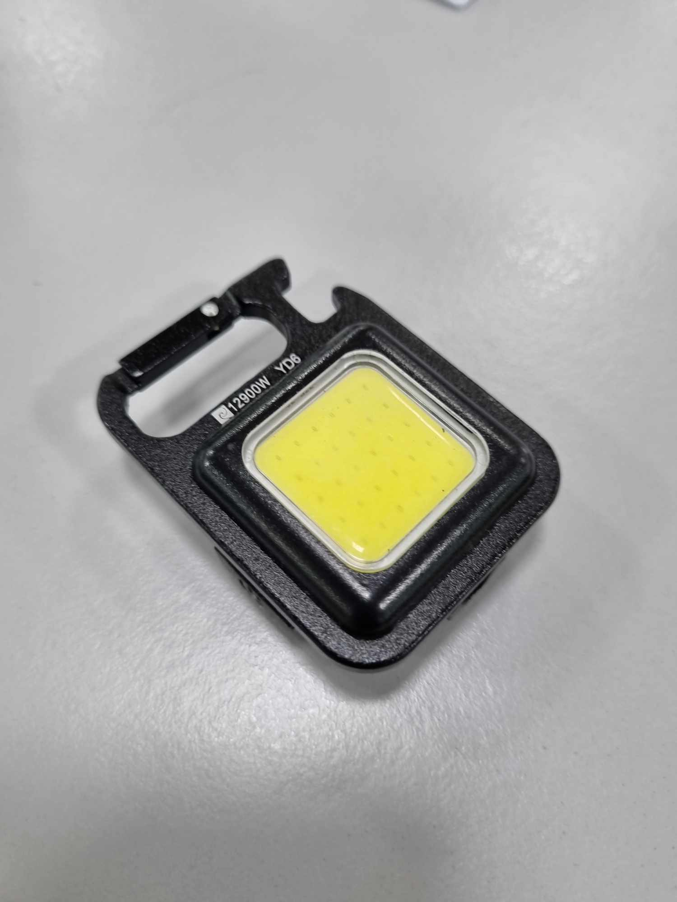

# Robocup Malaysia Open 2024 @Home League

Rule for the competition: https://2024.robocup.org.my/challenges-and-rules/home

## Table of contents
- [Scores](#scores)
   - [OPL](#home-opl)
   - [Education](#home-edu)
- [Schedules](#schedules)
   - [Day 1 - 5 Sep 2024](#day-1--5-september-2024)
   - [Day 2 - 6 Sep 2024](#day-2--6-september-2024)
   - [Day 3 - 7 Sep 2024](#day-3--7-september-2024)
   - [Day 4 - 8 Sep 2024](#day-4--8-september-2024)
- [Field Layout](#field-layout)
   - [Robot Checking](#robot-checking)
   - [Carry My Luggage](#carry-my-luggage)
   - [Find My Mate](#find-my-mate)
   - [Storing Groceries](#storing-groceries)
   - [Receptionist](#receptionist)
   - [General Purpose Service Robot](#general-purpose-service-robot)
   - [Stickler for rules](#stickler-for-rules)
   - [Clean the table](#clean-the-table)
- [Information](#information)

## Scores

### @HOME OPL
#### Overall
|#                |Team name|Task score (50%)|Final Internal Jury (25%)|Final External Jury (25%)|Total (100%)  |
|-----------------|---------|----------|--------|--------|-------|
|1                |TwiggiesAid 🥇 |50.00     |16.67   |20.53   |87.19  |
|2                |Team Terminator 🥈 |10.15     |25.00   |25.00   |60.15  |

#### Task score and Poster (Before normalized)
|#                |Team name|Poster|Stage1|State2|Total  |
|-----------------|---------|------|------|------|-------|
|1                |TwiggiesAid|7.5   |270   |715   |992.5  |
|2                |Team Terminator|6.5   |30    |165   |201.5  |
|3                |USM Infinity|8.33  |0     |0     |8.33   |
|4                |UTAR     |7.33  |0     |0     |7.33   |

#### Stage 2
|Team name        |Clean the table|Stickler for rules|Restaurant|Enhanced General Purpose Service Robot (EGPSR)|Stage 2 Total|Stage 1+2|
|-----------------|---------------|------------------|----------|----------------------------------------------|------------|---------|
|TwiggiesAid      |315            |300               |100       |0                                             |715         |985      |
|Team Terminator  |65             |0                 |100       |0                                             |165         |195      |
|USM Infinity     |-              |-                 |-         |-                                             |0           |0        |
|UTAR             |-              |-                 |-         |-                                             |0           |0        |

#### Stage 1
|Team name|Storing Groceries|Receiptionist|Carry my luggage|General Purpose Service Robot (GPSR)|Serve Breakfast|Stage 1 Total
|-|-|-|-|-|-|-|
| TwiggiesAid     |  30   |  115    |   15    |  50   |   60    |270  |
| Team Terminator |   -   |    -    |   15    |   0   |   15    | 30  |
| USM Infinity    |   -   |    -    |    -    |   -   |    -    |  0  |
| UTAR            |   -   |    -    |    -    |   -   |    -    |  0  |

### @HOME EDU

#### Overall

|#                |Team name|Task score (50%)|Final Internal Jury (25%)|Final External Jury (25%)|Total (100%)  |
|-----------------|---------|----------|--------|--------|-------|
|1                |UniMAP MechaMinds 🥇|46.29     |18.64   |16.98   |81.92  |
|2                |UM Homie 🥈|50.00     |17.32   |13.92   |81.24  |
|3                |Robo in Progress 🥉|41.08     |17.76   |16.51   |75.36  |
|4                |UM ENIGMA|24.43     |19.74   |18.40   |62.57  |
|5                |SOBITS   |7.35      |25.00   |25.00   |57.35  |
|6                |USM Titans|24.40     |15.35   |16.51   |56.26  |
|7                |kamerider UTHM|15.13     |17.76   |14.15   |47.05  |
|8                |Airost   |11.42     |16.23   |15.57   |43.22  |
|9                |YOLOv9   |5.85      |17.98   |15.57   |39.40  |
|10               |FATHI    |2.13      |16.45   |17.45   |36.03  |
|11               |UNIMY    |13.25     |10.53   |11.79   |35.57  |
|12               |PutraBot |3.97      |0.00    |0.00    |3.97   |

#### Task score and Poster (Before normalized)

|#                |Team name|Poster|Carry my luggage|Find my mates|Receptionist|Total  |
|-----------------|---------|------|----------------|-------------|------------|-------|
|1                |UM Homies|7.60  |500             |90           |750         |1347.60|
|2                |UniMAP MechaMinds|7.73  |400             |40           |800         |1247.73|
|3                |Robo in Progress|7.27  |450             |0            |650         |1107.27|
|4                |UM ENIGMA|8.50  |250             |0            |400         |658.50 |
|5                |USM Titans|7.64  |250             |0            |400         |657.64 |
|6                |kamerider UTHM|7.82  |250             |0            |150         |407.82 |
|7                |UNIMY    |7.09  |250             |0            |100         |357.09 |
|8                |Airost   |7.82  |200             |0            |100         |307.82 |
|9                |SOBITS   |8.00  |0               |90           |100         |198.00 |
|10               |YOLOv9   |7.73  |50              |0            |100         |157.73 |
|11               |PutraBot |6.91  |0               |0            |100         |106.91 |
|12               |FATHI    |7.45  |0               |0            |50          |57.45  |

<!-- Template

| Team name     |  Poster  |
|---------------|----------|
|USM Infinity   |          |
|   UTAR        |          |
|TwiggiesAid    |          |
|Team Terminator|          | 

-->

## Schedules

### Day 1 : 5 September 2024

#### @Home OPL Arena
| # |   Robot Checking (16:30)     | League     |
|---|------------------------------|------------|
| 1 | USM Infinity                 |   OPL      |
| 2 | UTAR                         |   OPL      |
| 3 | TwiggiesAid                  |   OPL      |
| 4 | Team Terminator              |   OPL      |

<!-- ### @Home Education league
####  -->

### Day 2 : 6 September 2024

#### @Home OPL Arena
|#|Storing Groceries (09:30)|#|Receiptionist (10:30)|#|Carry my luggage (11:30)
|-|-|-|-|-|-|
|1|~~UTAR~~|1|TwiggiesAid|1|Team Terminator|
|2|~~Team Terminator~~|2|~~USM Infinity~~|2|~~USM Infinity~~|
|3|~~USM Infinity~~|3|~~UTAR~~|3|~~UTAR~~|
|4|TwiggiesAid|4|~~Team Terminator~~|4|TwiggiesAid|

|#|General Purpose Service Robot (GPSR) (15:00)|#|Serve Breakfast (16:30)|
|-|-|-|-|
|1|TwiggiesAid|1|TwiggiesAid|1|TwiggiesAid|
|2|~~UTAR~~|2|Team Terminator|2|Team Terminator|
|3|~~USM Infinity~~|3|UTAR|3|~~USM Infinity~~|
|4|Team Terminator|4|USM Infinity|4|~~UTAR~~|

#### @Home EDU Arena

|#|Carry My Luggage (09:30)|#|Find My Mate (14:30)|
|-|-|-|-|
|1|USM Titans|1|Robo in Progress
|2|UM Homies|2|UM Homies
|3|UniMAP MechaMinds|3|kamerider UTHM
|4|UNIMY|4|YOLOv9
|5|Robo in Progress|5|Airost
|6|YOLOv9|6|USM Titans
|7|FATHI|7|PutraBot
|8|UM ENIGMA|8|UM ENIGMA
|9|Airost|9|FATHI
|10|SOBITS|10|SOBITS
|11|kamerider UTHM|11|UNIMY
|12|PutraBot|12|UniMAP MechaMinds

### Day 3 : 7 September 2024

#### @Home OPL Arena
|#|Enhanced General Purpose Service Robot (EGPSR) (09:30)|#|Clean the table (10:30)|#|Restaurant (13:30)|#|Stickler for rules (15:30)|
|-|-|-|-|-|-|-|-|
|1|USM Infinity |1|Team Terminator |1|USM Infinity|1|TwiggiesAid
|2|Team Terminator |2|TwiggiesAid |2|Team Terminator|2|USM Infinity
|3|UTAR |3|USM Infinity|3|UTAR|3|UTAR
|4|TwiggiesAid |4|UTAR |4|TwiggiesAid|4|Team Terminator

#### @Home EDU Arena
|#|Receptionist (09:30)|
|-|-|
|1|Airost
|2|kamerider UTHM
|3|PutraBot
|4|YOLOv9
|5|UM Homies
|6|USM Titans
|7|UNIMY
|8|SOBITS
|9|FATHI
|10|Robo in Progress
|11|UniMAP MechaMinds
|12|UM ENIGMA

### Day 4 : 8 September 2024

#### @Home OPL Arena
|#|Final (09:30)|
|-|-|
|1|TwiggiesAid|
|2|Team Terminator|

#### @Home EDU Arena
|#|Final (After OPL Final end)|
|-|-|
|1|PutraBot
|2|YOLOv9
|3|Airost
|4|SOBITS
|5|Robo in Progress
|6|UniMAP MechaMinds
|7|UM Homies
|8|FATHI
|9|UNIMY
|10|USM Titans
|11|UM ENIGMA
|12|kamerider UTHM

## Field Layout

### Robot Checking

### Carry My Luggage

_You can choose that you want the bag on the bed or on the floor_

### Find My Mate

### Storing Groceries

_For Storing Groceries, Kitchen Table will be used as Table and Kitchen Cabinet as Cabinet_

### Receptionist

_Host name is "Danny", His favorite drink is "Lime Juice"_

### General Purpose Service Robot

### Stickler for rules

### Clean the table
_This is the dishwasher tab, you can find this in Kitchen room_

## Information

- [List of names](./names/names.md)
- [List of drinks](./names//drinks.md)
- [List of room](./maps/room_names.md)
- [List of locations](./maps/location_names.md)
- [List of known objects](./objects/objects.md)
